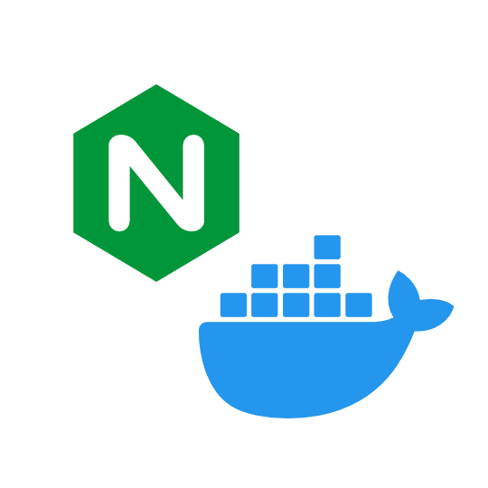

# Nginx builder inside Docker container



Nginx Development Environment based on official docker image and official source code.

### Build Docker container

```bash
# build all with:
./build
# or:
./build alpine
./build debian
```

### Pull ready to use Docker container

```bash
docker pull moujikov/nginx-docker-builder:1.25.3
docker pull moujikov/nginx-docker-builder:1.25.3-alpine
```

### Build nginx
To configure nginx build with default options run `/usr/src/nginx/configure.sh`. You can printf additional parameters to this file or edit it manually.

It is essential to use .sh file – we can't store command line parameters in a variable, since bash will ignore quoting by word splitting in constructions like `/usr/src/nginx/configue ${ALL_MY_PARAMS}` and, e.g. `--with-cc-opt='-g -O2 -fPIC'` will become 3 parameters with quotes included as is.

Example:
```bash
cd /usr/src/nginx
printf " --add-dynamic-module=${MODULE_PATH}" >> configure.sh
./configure.sh
make
make modules
make install
```
